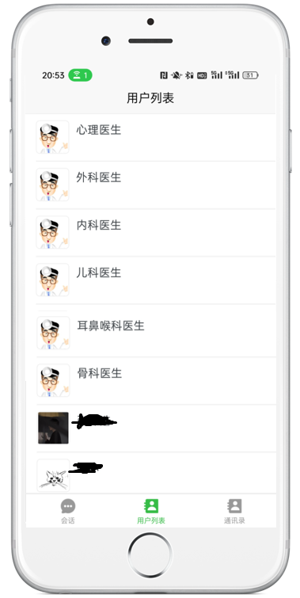

# 移动互联网开发技术课程设计

> **组号：5**
> **组名：开源先锋**

| 组长   | 组员1  | 组员2 | 组员3  | 组员4 |
| ------ | ------ | ----- | ------ | ----- |
| 张泽浩 | 黄文慧 | 郭昊  | 杨舒茹 | 王蕊  |

## 一、项目概述

​       该项目源于对社交与医疗服务的融合需求。该项目通过创建一个社交平台，引入ChatGPT作为各类医生的角色，涵盖心理医生、外科医生等，为用户提供了更广泛的医疗专业知识。用户可以注册账号、设置个人信息，并通过查询用户信息来添加好友并进行对话，以建立更加紧密的社交网络。该软件将社交功能与在线医疗服务相结合，为用户提供更为便捷的方式来获取医疗建议和进行线上咨询。

## 二、代码部署与使用方法、

### 2.1 前提条件

1. 开通uniCloud并创建服务空间 [控制面板](https://unicloud.dcloud.net.cn/)  ，本APP使用的是阿里云服务空间
2. 开通`uni-push2.0`

### 2.2 体验步骤

1. 使用`git clone`命令将仓库克隆到本地，点击使用`HBuilderX`导入项目
2. 对项目根目录`uniCloud`点右键选择“云服务空间初始化向导”界面按提示部署项目（注意：选择绑定的服务空间，须在uni-push2.0的关联）
3. 在HBuilderX控制台，更改`连接本地云函数`为`连接云端云函数`
4. 针对下图中①处的文件夹中的``index.js``文件中的②处代码，改为自己的``openai``的`key`
   
5. 针对①处的代码，将其中的`id`（②处）改为申请账号的`id`，可以在阿里云后台查看。
   
6. 在`manifcest.json`中重新获取属于自己的``AppID``
   
7. 运行项目

## 三、页面介绍

### 1. 登录页面

可以进行注册和登录

### 2. 会话窗口界面

1. **会话列表**：显示用户的即时通讯会话列表。
   支持根据最近聊天时间对会话列表进行排序。提供未读消息数的展示和消息提醒功能。
2. **我的**：点击进入个人中心页面
3. **用户聊天窗口**：点击会话列表中的项可进入对应的聊天窗口。
   在聊天窗口中，展示聊天记录、对方用户信息等。提供友好的时间显示，显示最后一条消息的时间。支持点击头像查看对方用户信息。

### 3. 通讯录界面

1. 通讯录界面主要用于展示并处理用户的通知信息，包括系统通知、好友请求通知等。用户可以通过界面清晰地查看通知内容，进行相应的操作，并及时了解到不同类型的通知。
2. **添加好友**：搜索手机号/用户名/用户昵称添加好友
3. **新朋友**：显示好友请求通知
4. **系统通知**：显示系统通知

### 4. 用户列表页面

1. **用户列表展示**：列表中展示了每个用户的头像和昵称。点击用户列表项进入与该用户的聊天窗口。
2. **下拉刷新和上拉加载更多**：下拉清空数据并重新加载最新的用户列表。上拉加载下一页的用户数据。
3. **动态加载用户头像和昵称**：用户列表动态加载每个用户的头像和昵称，若没有上传头像，则使用默认头像。
4. **聊天窗口跳转**：点击某用户项可进入对应的聊天窗口。根据屏幕宽度判断是在当前页面打开聊天窗口还是新窗口中打开，以提供不同的用户体验。

### 5. 个人信息页面

1. **头像上传**：通过拍摄或从相册选择照片，然后对图像进行缩放操作和截取，上传为头像。
2. **手机号绑定功能**：通过短信验证码的形式绑定手机号。
3. **实名认证功能**：系统在检测输入的身份证号的正确性后存储信息，并于该用户的其他相关信息绑定。
4. **修改密码功能**：输入新、旧、确认密码可更改密码。
5. **注销账号功能**：点击后会提示注销账号的后果，点击下一步会再次提示用户是否注销，防止误操作。

### 6. 聊天界面

**用户聊天窗口**：在聊天窗口中，展示聊天记录、对方用户信息等。提供友好的时间显示，显示最后一条消息的时间。支持点击头像查看对方用户信息。

